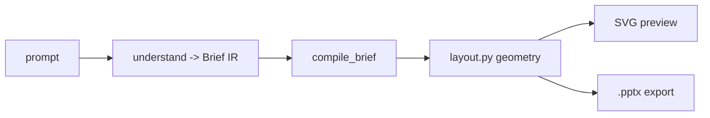

# pptx-copilot

Conversational generator for **technical cross-sections and engineering
infographics** — semiconductor packaging, silicon photonics, mobile/watch
mounting structures, and general report figures (timelines, tables, charts,
2×2 matrices, hierarchies). You describe the structure in natural language; a
small LLM decides the *meaning*, deterministic code owns the *geometry*, and the
same layout drives both the live SVG preview and the `.pptx` export.

> Status: WP1–WP11 implemented. `python backend/smoke_test.py` → **ALL PASSED**
> (router golden 30/30, golden-SVG regression, archetype + assembly presets).

## Why it works (architecture)

Four principles keep a *small* model reliable:

1. **JSON is the source of truth.** The LLM emits a semantic figure (materials,
   parts, relations) — never coordinates, colors, or physical dimensions.
2. **Geometry lives in one place** (`layout.py`). `render_svg.py` and
   `export_pptx.py` consume the *same* `DrawItem` primitives, so preview and
   export match by construction.
3. **Progressive refinement, not early commitment** (WP8). A request is first
   understood into an editable **Brief IR** (genre / parts / mounting /
   relations); the concrete figure is *compiled* from it. Edits change the Brief
   and recompile — so structural changes (solder → wire-bond) reach the geometry,
   not just a label.
4. **Deterministic tools + RAG absorb the hard parts.** Structure recipes
   (`domain.py`, `assemblies.py`), archetypes (`archetypes.py`), part knowledge
   (`parts.py`), a router, a linter/repair pass, and knowledge cards
   (`data/kb/*.jsonl`) mean the model makes small, guided choices.



## Tabs

- **단면도 스튜디오 (`/`)** — the core A/B branching tree: one request → two
  drafts → pick + revise → two variants. Shows the system's understanding
  (Brief), live partial rendering, and a free **canvas editor** (drag / text /
  add / delete → saved as a derived node; edits appear identically in the pptx).
- **슬라이드 (`/slides`)** — single-slide image + text composition.
- **벤치 (`/bench`)** — auto-run the test set across LLM endpoints (haiku /
  qwen3.5-122b / qwen3.6-27b / mock), deterministic scoring, a model × category
  heatmap, and per-case SVG side-by-side comparison.
- **설정 (`/settings`)** — configure model endpoints (URL + model name).

## Quick start (no model, ~3 min)

```bash
git clone https://github.com/bearsmiith/pptx-copilot && cd pptx-copilot
python3 -m venv .venv && . .venv/bin/activate
pip install -r requirements.txt

# smoke test (no model needed)
cd backend && MOCK=1 python smoke_test.py     # -> "ALL PASSED"

# run the app with the deterministic mock provider
MOCK=1 uvicorn app:app --app-dir . --port 8000
# open http://localhost:8000
```

Connect a real model in the **설정** tab (or via `data/config.json`): a local
OpenAI-compatible vLLM endpoint for Qwen, or `claude -p` (Claude Code CLI) for
Haiku. See **[docs/INSTALL_UBUNTU.md](docs/INSTALL_UBUNTU.md)** for the full
Ubuntu 24 + vLLM + [opencode](https://opencode.ai) setup.

## Supported domains

| Domain | Examples |
|---|---|
| Packaging | FC-BGA, CoWoS 2.5D, EMIB, HBM, fan-out (InFO), hybrid bond (SoIC), glass core (TGV), backside power, QFN, PoP |
| Photonics | SiPh WDM TX/RX, co-packaged optics, laser-on-PIC (solder/wire-bond/flip-chip), V-groove fiber, butterfly laser |
| Mobile / watch | Smartphone main board (SLP, PoP, shield can, double-sided, BTB), watch SiP (overmold + LGA), CIS (BSI stacked) |
| Displays | OLED, TFT, micro/mini LED |
| Infographics | timeline, KPI cards, comparison table, 2×2 matrix, bar/line chart, hierarchy tree, process flow |

## Repo layout

```
backend/   FastAPI app + engine (layout, render, compile_brief, understand,
           router, parts/domain/archetypes/assemblies, bench, ...)
frontend/  vanilla-JS tabs (no build step) + editor.js
data/kb/   knowledge cards (versioned); the rest of data/ is local user data
tests/     routing / bench / golden-SVG test sets
handoff/   design + research docs (the project's build history)
docs/      INSTALL_UBUNTU.md
```

## Docs

- **[docs/INSTALL_UBUNTU.md](docs/INSTALL_UBUNTU.md)** — Ubuntu 24 + vLLM + opencode
- **[AGENTS.md](AGENTS.md)** — agent/contributor work rules
- **[handoff/00_HANDOFF.md](handoff/00_HANDOFF.md)** — full design history (WP1–WP12)
